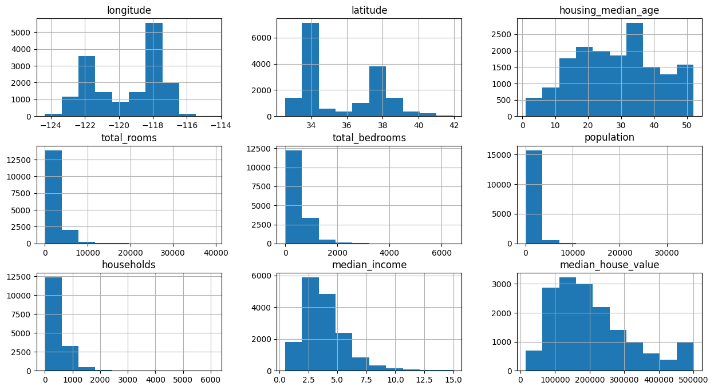
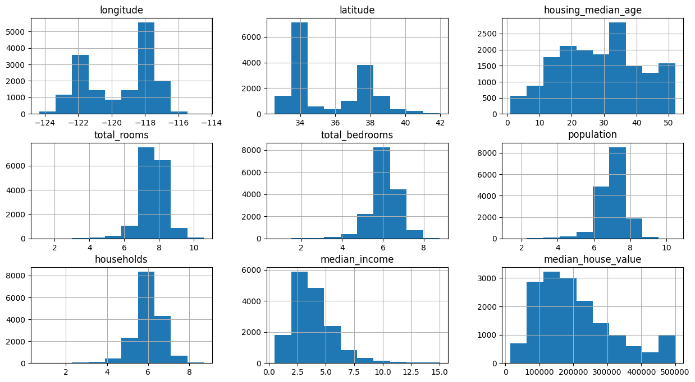
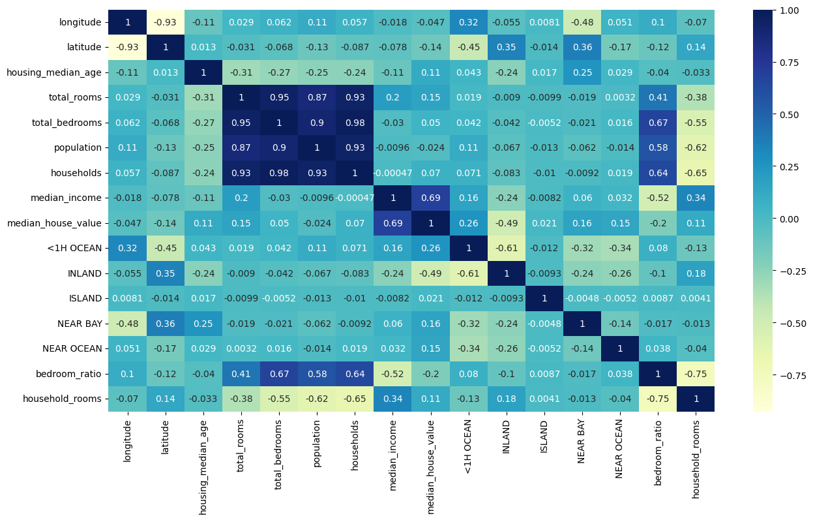
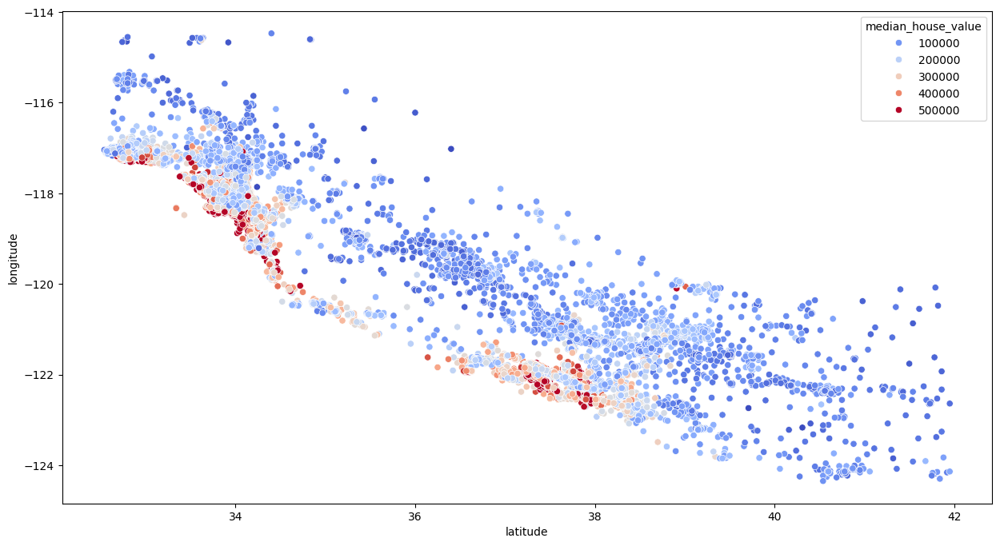

# 🏠 California Housing Price Prediction

My first end-to-end machine learning project — a self-study exercise where I predict the
**median house value** for California districts from census data.

The goal wasn't just to get a good score, but to practice the full ML workflow from scratch:
loading raw data → cleaning → exploratory analysis → feature engineering → training and
comparing models → tuning hyperparameters.

---

## 📊 Dataset

The project uses the classic **California Housing** dataset (`housing.csv`, ~20,640 rows),
based on the 1990 California census. Each row is a district described by 10 features:

| Column | Description |
| --- | --- |
| `longitude`, `latitude` | Geographic location of the district |
| `housing_median_age` | Median age of houses |
| `total_rooms`, `total_bedrooms` | Total rooms / bedrooms in the district |
| `population`, `households` | Population and number of households |
| `median_income` | Median income of residents (in tens of thousands) |
| `ocean_proximity` | Categorical: how close the district is to the ocean |
| **`median_house_value`** | **Target** — the value we want to predict |

---

## 🔬 What the notebook does

All the work lives in [`test.ipynb`](./test.ipynb). The pipeline, step by step:

1. **Load & inspect** the data with pandas (`.head()`, `.info()`).
2. **Clean** — drop rows with missing values.
3. **Train/test split** (80% / 20%) so evaluation is done on unseen data.
4. **Explore (EDA)** — histograms of every feature and a correlation heatmap with seaborn.
5. **Feature engineering:**
   - Apply a **log transform** to skewed columns (`total_rooms`, `total_bedrooms`,
     `population`, `households`) to make their distributions more normal.
   - **One-hot encode** the categorical `ocean_proximity` column.
   - Create new ratio features: `bedroom_ratio` and `household_rooms`.
6. **Scale** features with `StandardScaler`.
7. **Train & compare models**, then **tune** the best one with `GridSearchCV`.

---

## 🖼️ Visualizations

### Feature distributions — before and after the log transform
Several columns were heavily right-skewed. Applying `log(x + 1)` makes them far more
bell-shaped, which helps the linear model.

| Before | After |
| --- | --- |
|  |  |

### Correlation heatmap (after feature engineering)
After one-hot encoding and adding the ratio features, the correlations with the target
become clearer — `median_income` stands out as the strongest predictor.



### Geography vs. price
Plotting districts by `latitude`/`longitude` and coloring by house value reproduces the
map of California — the most expensive districts (red) cluster along the coast.



---

## 📈 Results

Models are evaluated with the **R² score** on the held-out test set (higher = better):

| Model | R² Score |
| --- | --- |
| Linear Regression | ~0.67 |
| Random Forest Regressor (default) | ~0.82 |
| Random Forest + GridSearchCV tuning | ~0.82 |

The **Random Forest** clearly outperformed linear regression, capturing the non-linear
relationships in the data. Hyperparameter tuning gave a small additional improvement.

> Note: exact numbers may vary slightly between runs because the train/test split is random.

---

## 🛠️ Tech Stack

- **Python 3.13**
- [pandas](https://pandas.pydata.org/) & [NumPy](https://numpy.org/) — data manipulation
- [Matplotlib](https://matplotlib.org/) & [seaborn](https://seaborn.pydata.org/) — visualization
- [scikit-learn](https://scikit-learn.org/) — modeling, scaling, and tuning

---

## 🚀 How to run

```bash
# 1. Install the dependencies
pip install pandas numpy matplotlib seaborn scikit-learn jupyter

# 2. Launch Jupyter
jupyter notebook test.ipynb

# 3. Run the cells top to bottom
```

Make sure `housing.csv` stays in the same folder as the notebook.

---

## 💡 What I learned

- How to take a raw CSV all the way to a working predictive model.
- Why **train/test splitting** matters, and the importance of only fitting the scaler on
  training data (then `transform`-ing the test set with it).
- How **log transforms** and **one-hot encoding** help prepare features.
- That **feature engineering** (creating ratios) can reveal stronger correlations.
- How to compare models and improve one with **`GridSearchCV`**.

---

## 🔭 Possible next steps

- Try other models (Gradient Boosting, XGBoost).
- Use cross-validation for more robust score estimates.
- Handle missing values by imputation instead of dropping rows.
- Add more engineered features (e.g. `rooms_per_household`, `population_per_household`).

---

*This is a learning project built while teaching myself machine learning. Feedback is welcome!*
